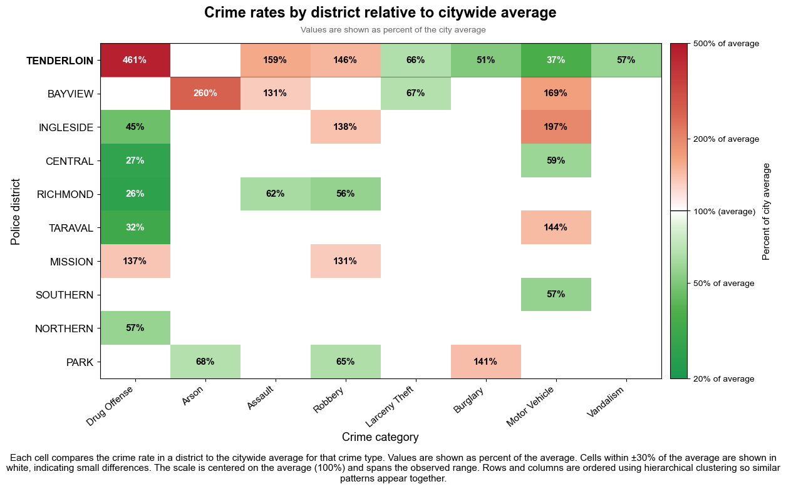

# Brief Introduction to the Dataset

This study uses publicly available data from the San Francisco Police Department incident dataset, which spans from 2003 to 2026. The dataset provides detailed information on reported crimes, including their geographic location, time of occurrence, and classification, allowing us to analyze spatial and temporal patterns of crime across the city. The dataset used in this study was constructed by merging two separate incomplete datasets, ensuring a continuous record across the full time period. However, because the 2026 records were still incomplete at the time of analysis, the dataset was restricted to the period 2003 to 2025 in order to avoid distortions in the results.

To focus the analysis, we selected the eight crime categories with the highest number of reported incidents: drug offenses, assault, robbery, larceny theft, burglary, motor vehicle theft, vandalism, and arson. This selection allows for a deeper examination of the most prevalent types of crime while maintaining a representative view of overall criminal activity.

---

# Heatmap of crime rates by district, shown relative to the citywide average.

We use a heatmap to visualize differences in crime patterns across San Francisco districts. This representation allows us to assess whether crime is evenly distributed across the city and to identify how different types of offenses vary across districts.

As shown in the heatmap, several districts exhibit elevated levels of property related crimes such as burglary, larceny theft, and motor vehicle theft. For example, Southern and Northern districts display higher than average rates in these categories. In contrast, other districts show more balanced profiles, with crime rates closer to the city average across multiple categories.

The heatmap also highlights differences between violent and property crimes across districts. Districts such as Bayview and Mission show relatively higher levels of assault and robbery, while districts like Northern and Southern are more dominated by theft related offenses such as larceny and burglary. These contrasts indicate that different districts exhibit distinct crime profiles rather than a uniform pattern across the city.

Against this broader backdrop, one district stands out clearly. The Tenderloin shows a particularly strong concentration of drug related offenses, reaching more than four times the city average. At the same time, it exhibits lower than average levels of crimes such as burglary, vandalism, and motor vehicle theft.

This distinct combination highlights a unique crime profile compared to other districts, where drug related activity is highly concentrated while property related crimes are relatively less prevalent.

The patterns observed in the heatmap can also be considered in light of broader developments in San Francisco during this period. Over the past two decades, the city has experienced significant shifts in policing strategies, public policy, and social conditions.

Changes in policing approaches, including periods of reduced enforcement and later efforts to increase police presence in high activity areas, may have influenced how crime is recorded and where it is concentrated. The appointment of new police leadership and shifts in policy priorities have also shaped enforcement strategies across the city, with particularly visible effects in neighborhoods such as the Tenderloin.

At the same time, San Francisco has faced growing challenges related to homelessness, housing affordability, and the concentration of social services in specific areas. While these factors affect the city more broadly, the Tenderloin has long been a focal point for many of these issues, which may contribute to the visibility and persistence of drug related activity in the district.

This concentration of drug related crime in the Tenderloin stands out as a key insight in the data and motivates a more focused spatial analysis. In the next section, we examine how these patterns extend beyond the district itself and how crime is distributed across the surrounding areas.

---

<iframe src="./visualizations/heatmap_with_time_sum.html" width="100%" height="500px"></iframe>

### The Drug Crime Geography

After seeing that Tenderloin has significantly higher rates of drug offenses compared to other districts, we became interested in whether every part of Tenderloin is equally affected by drug offenses, or if there are specific hotspots. To this end, we created a heatmap over time, that shows how drug related incidents are distributed both spatially and temporally across Tenderloin and its neighboring districts (Northern, Central and Southern).

The line chart in the bottom right shows Tenderloin's yearly incident count (orange) alongside the combined total for Northern, Central, and Southern districts (grey). Grouping those three districts into a single N+C+S line makes the comparison easier to read: for much of the 22-year period, the Tenderloin on its own keeps pace with, and in many years surpasses, all three of them put together. It puts a number to what the heatmap already shows spatially, that drug activity was packed into a very small area.

A key geographical finding is that the Tenderloin is a relatively small district compared to its neighbors. Because the entire district consists of only a few city blocks, high crime rates affect the neighborhood uniformly. This is reflected in the heatmap, where the Tenderloin appears as a "throbbing" red core consistently across the 22-year data span.

### The "Containment Zone" and Border Spillover

While the Tenderloin is the epicenter, the heatmap reveals that crime does not respect administrative boundaries. High-density "hotspots" are visible along the borders of neighboring districts. Historically, this is attributed to the "containment zone" policy.

As noted by local journal BeyondChron, starting in the 1960s, San Francisco used the Tenderloin to contain open drug dealing and public use to prevent it from spreading to more affluent areas like Union Square or the Marina [[2](https://beyondchron.org/sfs-drug-containment-zone/#:~:text=When%20I%20first,to%20other%20neighborhoods.)]. However the heatmap proves that as much as "love knows no bounds", neither do crimes, and the spillover into the Southern (SoMa) and Central districts is still significant, particularly during peak enforcement years.

### The 2008–2009 Peak: Policy vs. Reality

If we wanted to understand the massive spike during 2008-2009 in incidents, we first have to understand the nature of this data. Drug crime statistics often tell a story of police strategy rather than just the amount of drugs on the street.
The primary driver of the spike in 2009 was the arrival of George Gascón as Police Chief in August 2009 [[3](https://beyondchron.org/sf-public-defender-wrong-about-tenderloin-drug-dealing/#:~:text=their%20home%20neighborhoods.-,Prior%20Crackdowns,It%20was%20hugely%20successful.)]. Coming from the LAPD, Gascón was reportedly "shocked" by the open-air drug markets in the Tenderloin. Gascón immediately launched aggressive "buy-and-bust" operations and "hot-spot" policing. In the fall of 2009, arrests skyrocketed as units specialized in undercover narcotics sweeps crisscrossed the neighborhood. This created a massive, artificial peak in "drug offense" data because the police were finally recording and arresting for behavior they had previously ignored. [[4](https://www.governing.com/archive/protecting-and-preserving-tenderloin.html#:~:text=The%20police%20crackdown%20began%20in,eight%20people%20for%20dealing%20drugs.)].

The line chart backs this up: the N+C+S sum rises and falls in step with Tenderloin across 2008 and 2009. Central hit a high of 274 incidents in 2008, and Southern (SoMa) jumped to 1,348 that same year, which together pushed the combined total to its own peak. The timing across all three neighboring districts points to a city-wide enforcement shift rather than something specific to the Tenderloin, most likely tied to Gascón's arrival and the crackdown he brought with him.

### The Resurgence (2022–2025)

After a decade of lower activity (bottoming out in 2017), the heatmap shows a dramatic resurgence starting in 2022. This second "wave" is driven by several new factors.

Mayor London Breed declared a state of emergency to "take back the Tenderloin," prioritizing accountability over tolerance [[5](https://www.washingtonpost.com/national/san-francisco-tenderloin-emergency-declaration/2021/12/17/28143f26-5f7a-11ec-adf9-419903a85a5e_story.html)].
Also in 2023, Mayor Breed launched the Drug Market Agency Coordination Center (DMACC), a task force targeting open-air drug markets in the Tenderloin and SoMa. It brought together local, state, and federal agencies for intensive operations, resulting in over 3,000 arrests and close to 200 kilos of narcotics seized in its first year, fentanyl included [[6](https://www.sf.gov/news--san-francisco-dmacc-marks-one-year-milestone-200-kilos-narcotics-seized-and-3000-arrests)]. The California Highway Patrol (CHP) and the U.S. Attorney's "All Hands on Deck" initiative added to that arrest count [[7](https://www.sf.gov/news--san-francisco-issues-six-month-update-operation-dismantle-open-air-drug-markets)]. Unlike 2009, though, this wave was driven by the fentanyl crisis. The drug is potent enough that open-air markets became impossible for the city to ignore politically.

The Tenderloin drug data tells a cyclical story: when the "containment" of drug activity becomes politically or socially unbearable (as in 2009 and 2022), the city pivots to aggressive enforcement, creating visible spikes in crime data.

---

<iframe src="./visualizations/drug_offense_by_type_tenderloin.html" width="100%" height="500px"></iframe>

For the last part of the analysis, we took the dataset and narrowed it down to Tenderloin drug offenses, filtering by crime category, police district, and date. Each incident's free-text description was then run through a keyword classifier that assigned one of eight drug categories. From there, the records were counted up by year and category to get the numbers behind the stacked area chart.

Two peaks jump out. The first, in 2009, lines up with SFPD Chief George Gascón's arrival and his push for aggressive buy-and-bust operations. Crack cocaine arrests were the main driver of that spike. The second uptick, which starts around 2022, looks quite different in composition: heroin/opiate and paraphernalia incidents make up most of the increase, tying into the fentanyl crisis and Mayor Breed's emergency declaration. Worth keeping in mind: the data captures enforcement activity, not drug use. Higher counts can just as easily mean more arrests as more crime.

Each visible pattern in the chart corresponds to a documented real-world event or enforcement shift:

**2003–2010 — Crack cocaine dominance**
The thick red band in the chart makes it pretty clear the Tenderloin was overwhelmingly crack-dominated during this stretch. Numerically, crack cocaine made up roughly 55–65% of all categorised incidents in the peak years. That lines up with the broader crack cocaine trend across the US during the 2000s [[1](https://pmc.ncbi.nlm.nih.gov/articles/PMC2565489/?utm_source=chatgpt.com)].

**2009 spike — Gascón's buy-and-bust campaign**
The spike across nearly every category can be traced back to the buy-and-bust operations running at the time. All drug types rise together, which is what you'd expect from a surge in aggressive policing rather than an actual increase in drug use.

**2017 trough — Deprioritised enforcement**
The low numbers here say more about police priorities than the actual state of drug activity in the neighbourhood. According to [[2](https://beyondchron.org/police-fail-tenderloin/#:~:text=Captain%20Fabbri%20told%20me%20that%20there%20is%20no%20point%20making%20arrests%20because%20those%20taken%20into%20custody%20immediately%20return%20to%20the%20streets%20and%20never%20face%20a%20risk%20of%20jail.%20That%E2%80%99s%20part%20of%20the%20longtime%20police%20response%20to%20resident%20complaints%2C%20which%20is%20to%20%E2%80%9CBlame%20the%20DA%20and%20the%20judges.%E2%80%9D)], officers weren't bothering with drug arrests because suspects would simply be back on the street shortly after, with little accountability from the courts.

**2018–2025 — Fentanyl crisis and shifting composition**
From around 2018 onward, heroin/opiates take the top spot from crack cocaine and stay there. This tracks with the broader fentanyl crisis playing out across the US, and in San Francisco in particular, where the mayor declared a state of emergency in the Tenderloin [[3](https://www.davidperry.com/newsroom/mayor-london-breed-declares-state-of-emergency-in-the-tenderloin.html#:~:text=%E2%80%9CWe%20are%20losing,Supervisor%20Matt%20Haney.)].

The uptick in paraphernalia arrests likely reflects officers picking up people carrying drug-related equipment, whether that meant suspected users or dealers.
